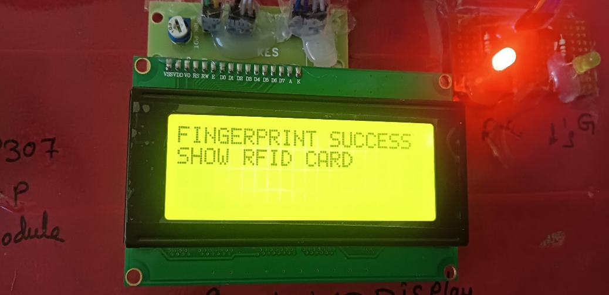
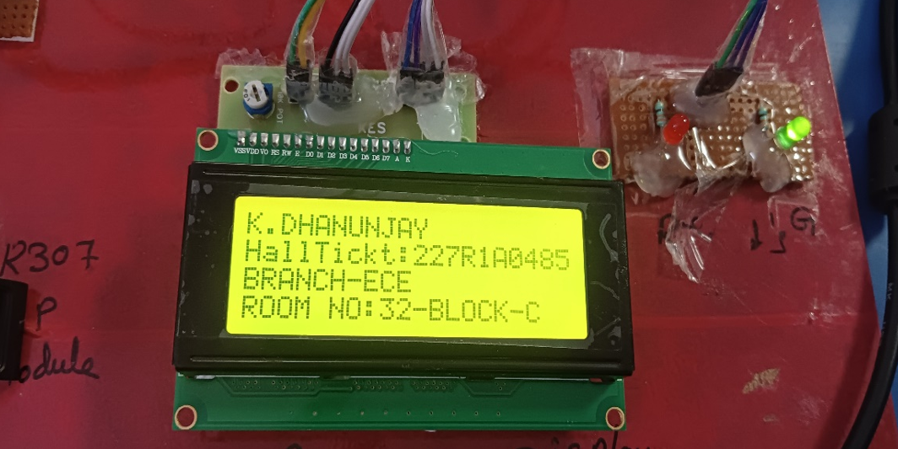
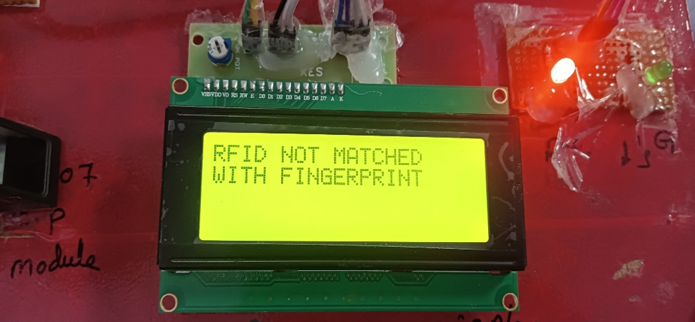

# RFID-Examination-Room-Guide
A smart system that uses RFID and fingerprint authentication to guide students to their examination rooms efficiently.
##  Technologies Used
- RFID Module
- Fingerprint Sensor
- Arduino / Microcontroller
- Embedded C
##  Working Process
1. Student scans RFID card
2. Fingerprint is verified
3. System checks database
4. Exam room details are displayed
##  Project Images

##  Result
The system successfully reduces manual errors and helps students quickly find their examination rooms.
